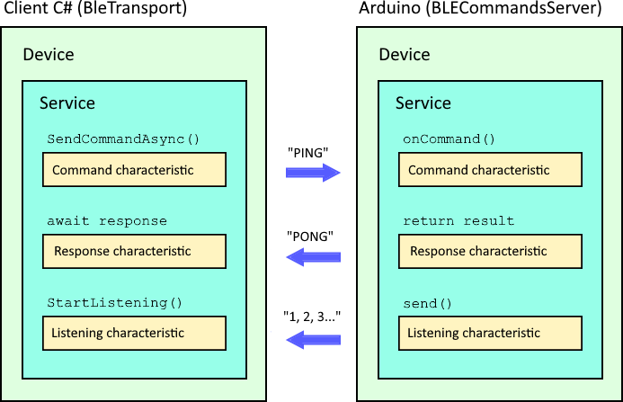

# BLE Transport

On the Arduino side, `BLECommands` creates a peripheral device (server) with a user-specified name, creates a service, and appends three characteristics to it:

- **Command** – used to send commands from the client to the device.
- **Response** – used to send command responses from the server to the client.
- **Listening** – used by the server to send notifications to the client.

Both client and server use predefined UUIDs for the service and characteristics:

|                   | UUID                                   |
|-------------------|----------------------------------------|
| Service           | `DB341FB3-8977-4C2D-AC6C-74540BD8B901` |
| Command Characteristic   | `DB341FB3-8977-4C2D-AC6C-74540BD8B902` |
| Response Characteristic  | `DB341FB3-8977-4C2D-AC6C-74540BD8B903` |
| Listening Characteristic | `DB341FB3-8977-4C2D-AC6C-74540BD8B904` |

> The Listening characteristic can be used by the server to send any information, such as current position or temperature. The client can start the listening procedure and receive all messages via events.  
> Introduce a final token in your protocol (e.g., `'END'`) so the client knows when to stop listening.

# Interaction

Maximum size of command with arguments is 512 bytes. The length of responses to commands and outgoing messages is limited only by available memory; texts are encoded as UTF-8 strings.