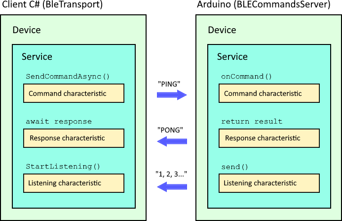

# BLE Transport
The [Arduino BleCommands library](https://github.com/andrey-val-rodin/BleCommands.Arduino) provides reference firmware that creates a peripheral device (server) with a user-specified name, a service, and three characteristics:

- **Command** — used to send commands from the client to the device
- **Response** — used to send command responses from the server to the client
- **Listening** — used by the server to send notifications to the client

Both client and server use predefined UUIDs for the service and characteristics:

|                          | UUID                                   |
|--------------------------|----------------------------------------|
| Service                  | `DB341FB3-8977-4C2D-AC6C-74540BD8B901` |
| Command Characteristic   | `DB341FB3-8977-4C2D-AC6C-74540BD8B902` |
| Response Characteristic  | `DB341FB3-8977-4C2D-AC6C-74540BD8B903` |
| Listening Characteristic | `DB341FB3-8977-4C2D-AC6C-74540BD8B904` |

> The Listening characteristic can carry any information the server wants to push: current position, temperature, sensor readings, log lines. The client receives these messages as tokens via `ListeningTokenReceived`.
>
> If your application protocol has a notion of "end of stream", introduce a final token (e.g., `END`) so the client can detect it. This is an application-level concern; the transport itself only splits the stream into tokens by the configured delimiter.

## Interaction



Maximum size of a command with arguments is 512 bytes. The length of responses to commands and outgoing messages is limited only by available memory; texts are encoded as UTF-8 strings.

To send large text, the [Arduino BleCommands library](https://github.com/andrey-val-rodin/BleCommands.Arduino) splits the message into chunks of up to 200 bytes. Each chunk is written to the Response or Listening characteristic and transmitted as a separate BLE notification. The client receives these notifications and reassembles the original message.

Chunks are created only at UTF-8 character boundaries. A multi-byte UTF-8 character is never split between two BLE notifications. This is a protocol requirement: peripherals implementing the BleCommands protocol must send valid UTF-8 fragments, and must not split a UTF-8 character across fragments. The .NET client decodes each received fragment separately and therefore is not intended to reassemble arbitrary byte streams from unrelated BLE peripherals.

To allow the client to detect the end of the transmission, a special delimiter character is used. The default is `'\n'`. You can specify your own terminator in setup, for example:

```cpp
TERMINATOR = '\x04'; // EOT
```

On the client side, create a transport with the `tokenDelimiter` parameter specified:

```c#
await ArduinoClient.CreateTransportAsync("My BLE device", '\x04');
```

## Protocol requirements

The client-side library is designed to work with peripherals implementing the [BleCommands.Arduino](https://github.com/andrey-val-rodin/BleCommands.Arduino) protocol.

The protocol uses UTF-8 text and a token delimiter:

- Every transmitted fragment must contain valid, complete UTF-8 sequences.
- A multi-byte UTF-8 character must not be split between fragments.
- Fragments are reassembled until the configured token delimiter is received.
- The delimiter is not included in the resulting token.
- The default delimiter is `\n`, but both sides must use the same delimiter when it is overridden.

A peripheral that sends arbitrary binary fragments or splits UTF-8 sequences across notifications is not compatible with the text transport implemented by `BleCommands`.

## Transport implementations

`BleCommands` ships two ready-to-use transport implementations:

- `BleCommands.Windows.BleTransport` — for Windows (WinRT Bluetooth LE API)
- `BleCommands.Maui.BleTransport` — for .NET MAUI (Plugin.BLE)

Both are tailored for devices running firmware based on the BleCommands.Arduino library, which exposes three separate characteristics: Command, Response, and Listening.

The transport itself does not depend on Arduino. It works with any peripheral that follows the protocol described above: UTF-8 text messages of arbitrary length, split into fragments and terminated by a configurable delimiter. The peripheral may be built on any platform — Arduino, ESP32, Zephyr, a custom BLE stack — as long as it speaks the protocol.

If your device does not match the standard three-characteristic layout, derive a custom transport from `BleTransport<TDevice, TService, TCharacteristic>` and override `StartAsync`. The base class provides the command/response machinery, token aggregation, timeout handling, and disposal; you only override the parts that differ.

For a complete example, see the integration-test transports for the [Rotating Table](https://table-360.ru/) device (a commercial product used here as a real-world example):

- [RotatingTableTransport.cs (Windows)](https://github.com/andrey-val-rodin/BleCommands/blob/main/Source/IntegrationTests.Windows/RotatingTableTransport.cs)
- [RotatingTableTransport.cs (MAUI)](https://github.com/andrey-val-rodin/BleCommands/blob/main/Source/IntegrationTests.Maui/RotatingTableTransport.cs)

The real Rotating Table has a single Update characteristic that carries both command responses and listening tokens. The test transports implement this layout by overriding `StartAsync` and sharing one characteristic between `ResponseCharacteristic` and `ListeningCharacteristic`.

## Command responses and timeouts

`SendCommandAsync` matches responses to commands by arrival order. The transport does not provide correlation IDs.

If a command times out or is cancelled, the command may still be processed by the device and its response may arrive later. A delayed response can then be returned by the next `SendCommandAsync` call, where it cannot be distinguished from that call's actual response.

Set `ResponseTimeout` with sufficient margin for the device and communication conditions. If reliable request/response matching is required, include a unique command identifier in the application protocol and validate it in each response.

> Note that `ResponseTimeout` applies only to `SendCommandAsync`. It is independent of the listening timeout configured when a listening session is started.

## Listening and subscription

The Listening characteristic is used by the device to push messages to the client. At the BLE level, the client must subscribe to notifications or indications for this characteristic before the device begins data transmission. Subscription is established by writing to the Client Characteristic Configuration Descriptor. On some platforms, this process takes 50–70 ms.

The listening session is also responsible for the `ListeningTimeoutElapsed` event: if no token is received within the configured interval, the event is raised. This is independent of the subscription itself — the subscription may be active while no listening session is in progress.

### Why the base transport subscribes in `StartAsync`

Consider a typical scenario:

1. The client sends a `MOVE` command.
2. The device responds `OK` and immediately starts streaming position updates on the Listening characteristic.
3. The client wants to receive every position update, including the first one.

If the client subscribed to the Listening characteristic only after receiving the `OK` response, the first updates would be lost: the device starts sending before the subscription is in place, and BLE notifications are not buffered by the peripheral for a client that is not subscribed.

To avoid this race, the base transport subscribes to the Listening characteristic in `StartAsync`, before any command is sent. As a result:

- `ListeningTokenReceived` may fire as soon as the transport is started, independently of whether a listening session is active.
- No messages are lost between the moment the device starts streaming and the moment the application begins processing them.

This is a deliberate trade-off. The subscription stays active for the lifetime of the transport, which is slightly less energy-efficient but eliminates a whole class of message-loss bugs.

> Note that the energy-saving benefit comes mostly from the device side: with an active subscription, the device may push notifications whenever it has data, while without a subscription it stays silent. If your device only sends data in response to commands, the difference is minimal.

### Overriding subscription strategy

If your application needs explicit control over the subscription — for example, to unsubscribe from the Listening characteristic when the stream is not needed, or to save power on a battery-powered device — override `StartAsync` and move the `StartReceivingAsync` call to a new method such as `StartMessagingAsync`:

```c#
public override async Task StartAsync(CancellationToken token = default)
{
    ThrowIfDisposed();

    if (IsStarted)
        return;

    ResponseCharacteristic.AttachTokenAggregator(new TokenAggregator(TokenDelimiter));
    ListeningCharacteristic.AttachTokenAggregator(new TokenAggregator(TokenDelimiter));

    await ResponseCharacteristic.StartReceivingAsync(token);
    // Do not subscribe to ListeningCharacteristic here.

    IsStarted = true;
}

public async Task StartMessagingAsync(CancellationToken token = default)
{
    ThrowIfDisposed();
    if (!IsStarted)
        throw new InvalidOperationException("Transport has not been started.");

    await ListeningCharacteristic.StartReceivingAsync(token);
}

public async Task StopMessagingAsync(CancellationToken token = default)
{
    ThrowIfDisposed();
    if (!IsStarted)
        throw new InvalidOperationException("Transport has not been started.");

    await ListeningCharacteristic.StopReceivingAsync(token);
}
```

For brevity, the example omits session bookkeeping. A real implementation should also track whether messaging is already active and guard against repeated calls.

Be aware of the trade-off: in this design, tokens sent by the device before `StartMessagingAsync` completes are lost. If your device starts streaming immediately after responding to a command, either keep the base behaviour (subscribe in `StartAsync`) or send the command that triggers the stream only after `StartMessagingAsync` has completed.

A device with a single characteristic for both responses and listening can also be supported by overriding `StartAsync`; see the Rotating Table transports linked above.