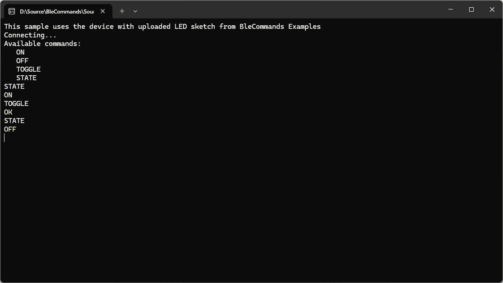
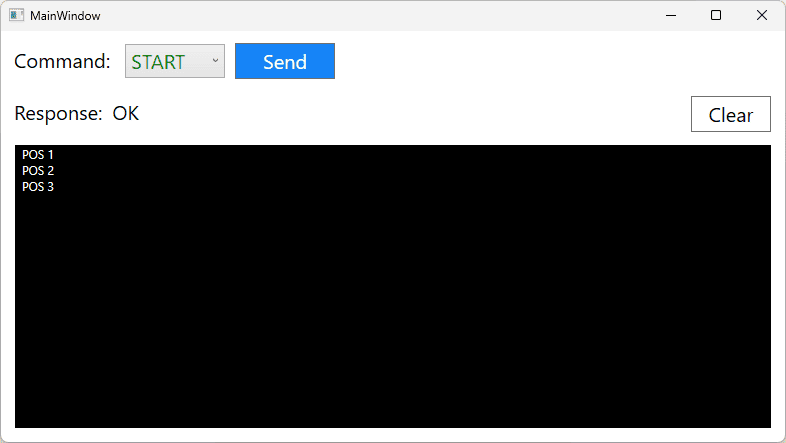
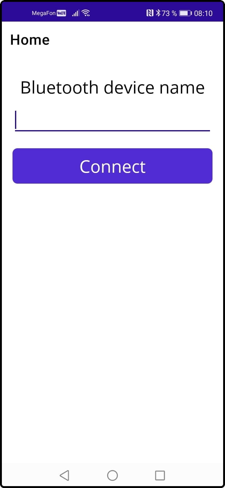
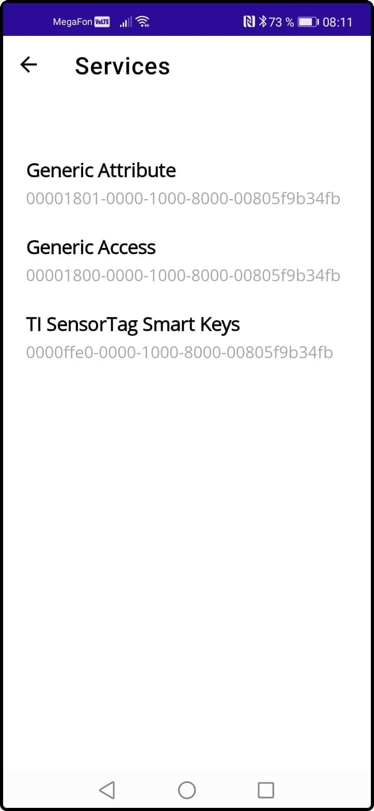
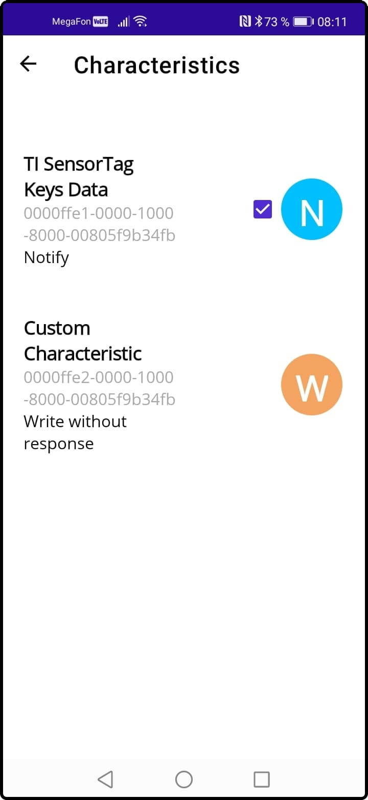
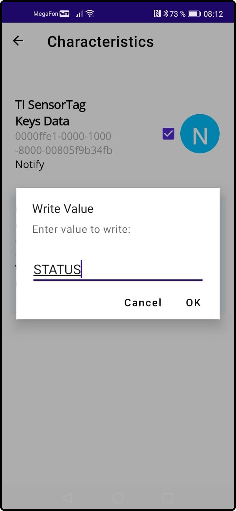

# Samples

## ConsoleSample

This sample works together with example LED of Arduino library `BleCommands.Arduino`.

The sample demonstrates sending commands to Arduino BLE device and receiving response.

## WPFSample

This sample works together with example Messaging of Arduino library `BleCommands.Arduino` and demonstrates sending commands in WPF and listening for messages.

Send command `START` or `STOP` and see command response and messages from the device.

## MauiSample

This example demonstrates using device, services and characteristics in MAUI.

Enter name of any advertised device and connect to it. Then you can explore device's services and characteristics. On Characteristics page you can read, write and get notifications from appropriate characteristic.

 

 
